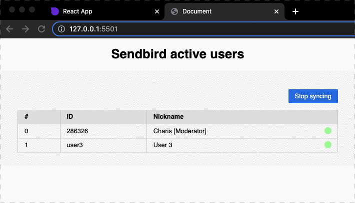

# sendbird-active-users

> This is a sample app that is **listing all currently active users** connected to Sendbird.

[](https://recordit.co/d2Fwk7OLJZ)

This project is synchronising the active users table in set intervals. You can alter the interval by changing the `SYNC_INTERVAL` variable inside of the `index.js` file.

## Run

From the root of the project, use any of the following quick solutions to start a web server:

```sh
python -m SimpleHTTPServer
```

or

```sh
npx live-server ./
```